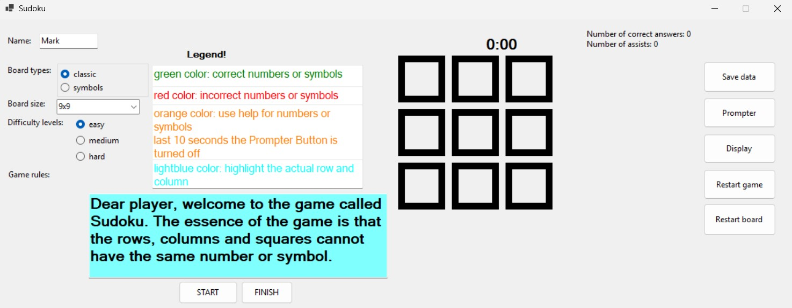
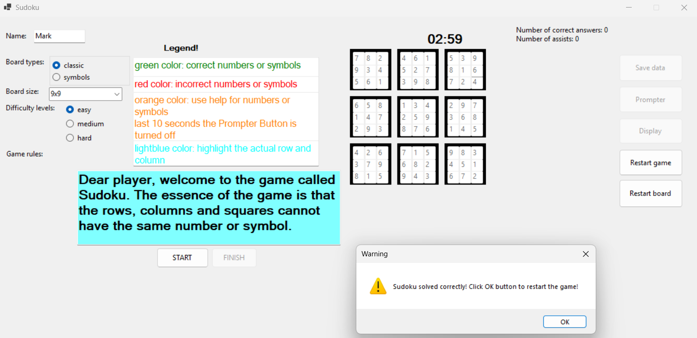
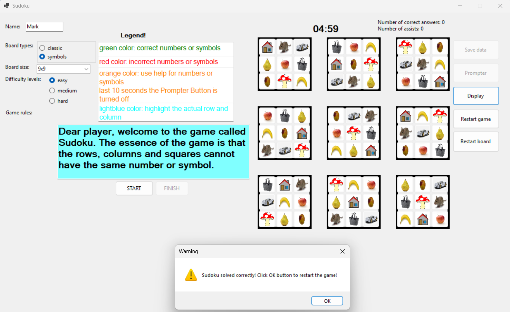
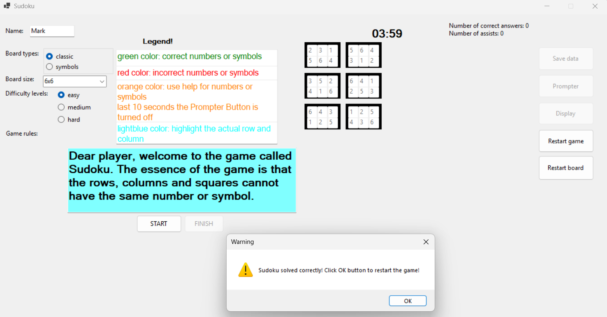
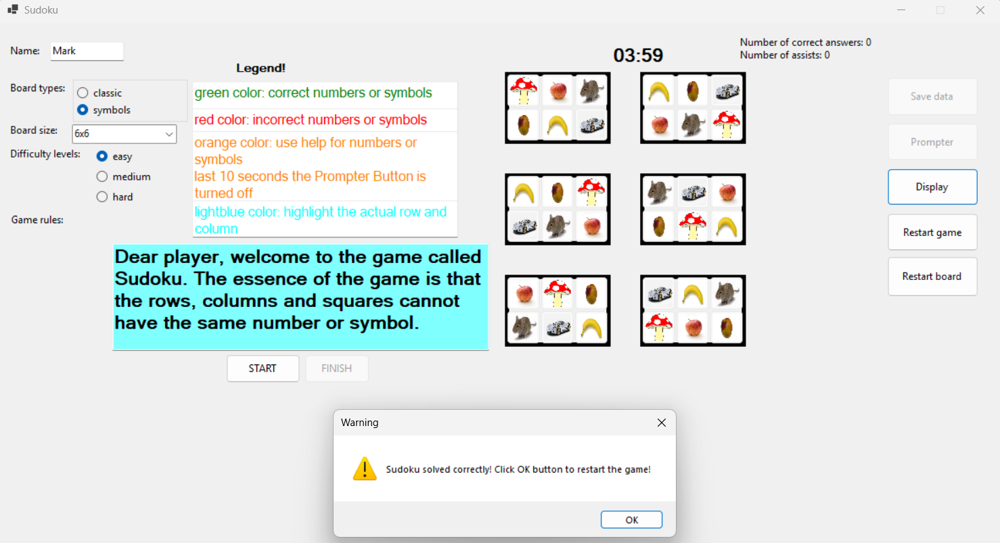

The aim of the thesis is to create a single logic game Sudoku,
which can be played at different difficulty levels. In case of a problem, provide a suggestion
for a possible good move in exchange for a penalty point. At the end, the game evaluates and
ranks the player based on the number of correct moves taken and the elapsed playing time.

We have two types of sudoku game classic and symbol and 2 board types 9x9 and 6x6.

Main page 

Classic sudoku 9x9

Symbol sudoku 9x9

Classic sudoku 6x6

Symbol sudoku 6x6

